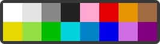

### [Pixel Canvas](https://pixelcanvas.io) bot

## 

Setup:
- Install [Node.js](https://nodejs.org/) and [ImageMagick](https://imagemagick.org/)
- Clone the repository using `git clone https://github.com/mekb-turtle/pixel-canvas-bot.git` or download .zip/.tar.gz of the repository and extract it
- Create a new file called `.env` in the directory of the repository
- Go to [Pixel Canvas](https://pixelcanvas.io)
- Open network tab in developer tools
- Click a pixel on the canvas to draw it
- Open one of the network requests that says `pixel` (not `online` or `X.Y.bmp`)
- Add `FIREBASE=` followed by the value of `X-Firebase-AppCheck` from the request headers to the `.env` file
- Add `FINGERPRINT=` followed by the value of `fingerprint` from the request body as JSON to the `.env` file
- Run `npm i` in the directory to install the dependencies
- Use `node . --help` for help
